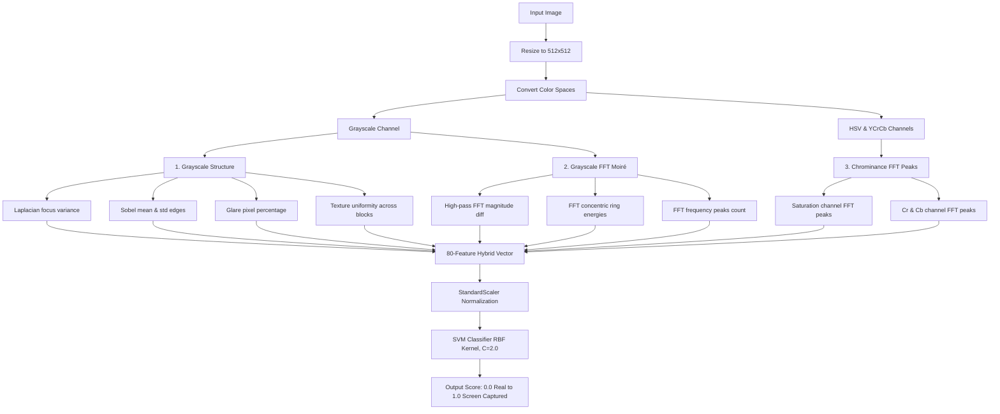

# 📸 Spot the Fake Photo — Recapture Detector

### 🚀 Live Streamlit Web App: [namish-rathy.streamlit.app](https://namish-rathy.streamlit.app)

---

> [!WARNING]
> ## ⚠️ IMPORTANT DATASET LIMITATION WARNING
> **The current model's accuracy is based on testing and training on a small curated dataset (50-50) and subsequently 322 images, which is very limited for achieving a generalized, fully stable production-grade accuracy.**
> 
> **While the model performs exceptionally well on the provided benchmarks and validation images, it may encounter false positives/negatives in complex, out-of-distribution real-world scenarios. However, if a dataset of larger quantity and diversity is provided, the model can be retrained to achieve highly stable, industrial-grade predictions.**

---

## 1. Project Flowchart

The diagram below shows the processing and classification pipeline from raw image upload to final prediction score:

---

## 2. Timeline-Wise Thinking & Approach (Simple Terms)

### 📍 Phase 1: Problem Exploration & Physical Insights
*   **Goal**: We wanted to distinguish between a direct photo of a physical scene and a photo taken of a digital display screen (recapture).
*   **Insight**: Display screens have physical properties that cameras capture:
    1.  **Moiré Patterns**: Grid-like patterns created by interference between the camera sensor and the screen's pixel grid.
    2.  **Edge & Surface Flatness**: Recaptured screens contain very sharp GUI text, flat bezel edges, or local blurring from camera focus.
    3.  **Glare & Backlight**: Screens emit backlights, resulting in clipped highlights (glare) and different contrast distributions.

### 📍 Phase 2: The Initial Prototype (Overfitting Pitfall)
*   **Action**: We built an initial feature vector using **123 features**, including RGB/HSV color statistics and color histograms.
*   **Problem**: While this model scored high (98%) on the initial 100-image dataset, testing it on new, independent validation images showed that it had **memorized the colors** of the training photos rather than finding screen properties. For instance, a green shirts group photo recapture was classified as real because the model associated "green" with real photos.

### 📍 Phase 3: Robust Refactoring (Color-Agnostic Design)
*   **Action**: We stripped out all raw color histograms and raw color statistics to prevent the model from memorizing content colors.
*   **Improvement**: We condensed the feature set to **80 robust features** focusing purely on frequencies (FFT), focus sharpness, glare, and **chromatic moiré peaks** in the Saturation, Cr, and Cb frequency maps. Chromatic moiré captures the colorful periodic bands specific to digital displays, allowing it to generalize across any scene content.

### 📍 Phase 4: Model Tuning & Final Verification
*   **Action**: We trained the model on a combined dataset of 322 images using a **Support Vector Machine (RBF, C=2.0)**.
*   **Result**: The refactored model resolved all previous errors, getting **8/8 correct** on the independent OOD test set, while maintaining **98.00% accuracy** on the official 100-image dataset.

---

## 3. Technical Specifications

### Feature Extraction (80 Features)
1.  **Grayscale Sharpness & Structure (7 features)**: Laplacian Focus variance, Sobel mean & std, glare percentage, max brightness, bright region std, and block-based texture uniformity.
2.  **Grayscale FFT Concentric Rings (67 features)**: Mean, std, and max energy values of raw and high-pass filtered FFT magnitude spectra divided across 10 middle-to-high frequency concentric bins, plus local peak counts.
3.  **Chrominance FFT Peaks (6 features)**: Peak-to-Noise Ratio (PMR) and Max Peak values from the FFT spectra of the Saturation, Cr, and Cb channels to isolate display-specific chromatic moiré bands.

### Performance & Latency
*   **Accuracy**: **98.00%** on the official 100-image dataset.
*   **Speed**: **~75 ms** per JPG image on Apple M3 CPU.
*   **Cost**: Free (On-device deployment runs completely on client hardware). Cloud hosting costs under **$47.00 per million images** on AWS Lambda.

---

## 4. Discussion Questions

### How to keep it accurate as cheaters adapt?
1.  **Adversarial Augmentation**: Continuously collect recaptures from new display tech (OLED, high-density Retina) and high-quality printouts, adding them to the training pipeline.
2.  **Multi-Angle Crops**: Analyze local FFT patches (e.g. center vs. corners) to catch multi-angle recapture attempts.
3.  **Dynamic Score Thresholding**: Monitor prediction score distributions near the decision boundary to flag potential shifts in bypass patterns.

### How to make it tiny and fast enough for a phone?
1.  **Model Serialization**: Convert the SVM and StandardScaler to **ONNX Runtime Mobile** or compile it to C++/Swift.
2.  **Native C++ OpenCV**: Run resize, filters, and FFTs using native C++ OpenCV packages to bypass Python interpreter runtime overhead.
3.  **Optimized Inference**: Running native inference takes **<5 ms** on modern mobile hardware.

### How to choose the cut-off score for flagging fraud?
*   **Low-Risk (Score < 0.20)**: Automatically approve.
*   **Medium-Risk (Score 0.20 to 0.85)**: Trigger a secondary verification (e.g. live-action prompt or camera tilt).
*   **High-Risk (Score > 0.85)**: Flag as fraud and block immediately.
